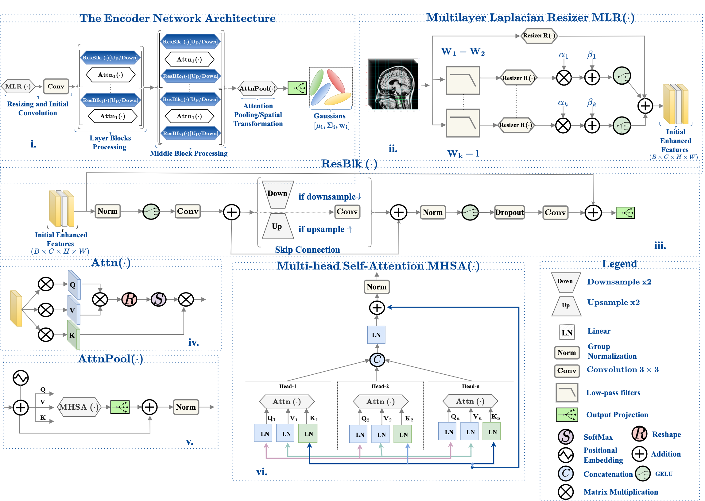

# Neural Steered Mixture of Experts for Medical Image Denoising and Super-Resolution  

**[Aytaç Özkan](https://www.linkedin.com/in/aytacozkan/), [Thomas Sikora](https://scholar.google.com/citations?user=2kr3tg0AAAAJ&hl=en)**  
📄 [Access the Paper](https://papers.ssrn.com/sol3/papers.cfm?abstract_id=5193694#paper-references-widget)  
⭐ If this work supports your research, please star the repository.  

---

## Overview

Medical image acquisition is often constrained by hardware limitations and prolonged scanning durations, leading to reduced spatial fidelity. Super-resolution (SR) techniques address these limitations by reconstructing high-resolution (HR) representations from low-resolution (LR) observations, thereby enhancing diagnostic interpretability.

However, conventional single-image super-resolution (SISR) methods often rely on simplified noise assumptions, such as additive white Gaussian noise (AWGN), which fail to capture the non-stationary and modality-dependent degradations present in clinical settings.

We introduce the **Neural Steered Mixture of Experts (N-SMoE)** framework, a generative adversarial model for joint image denoising and SR. It incorporates:

- A Laplacian resizer and bandpass filtering in the encoder for capturing local and high-frequency structures.
- A probabilistic steered mixture of experts decoder with edge-aware gating mechanisms and autoregressive modeling using 2D adaptive kernels.
- A stochastic degradation model (SDM) to simulate diverse and realistic noise patterns during training.

This architecture yields state-of-the-art (SOTA) performance across multiple medical imaging benchmarks, while maintaining interpretability and robustness across modalities.



---

## Features

- Unified framework for denoising and super-resolution in clinical images
- Edge-aware mixture of experts decoder with autoregressive signal modeling
- Stochastic degradation model for training under modality-specific noise
- Generalization across synthetic and real-world datasets

---

## Requirements

- Python 3.8
- PyTorch 1.13.0
- Complete environment setup will be provided upon release

---

## Code & Models

The training and inference scripts, along with pretrained weights, will be released soon.

---

## Citation

```
Oezkan, Aytac and Sikora, Thomas, Neural Steered Mixture of Experts for Medical Image Denoising, and Super-Resolution. SSRN: https://ssrn.com/abstract=5193694
```

---

## Contact

For questions, contact: **aytac@linux.com**
